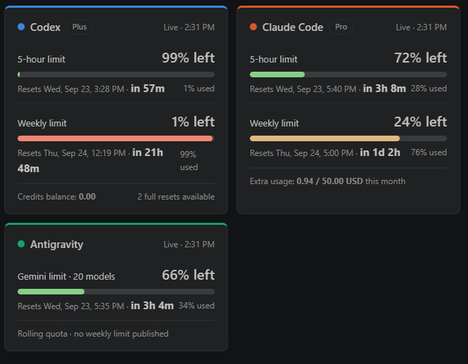
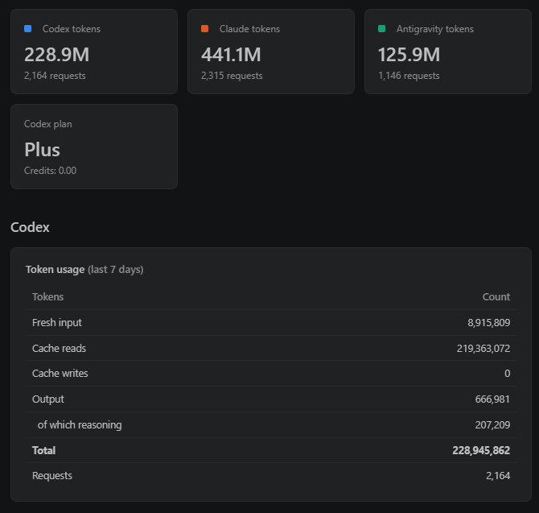
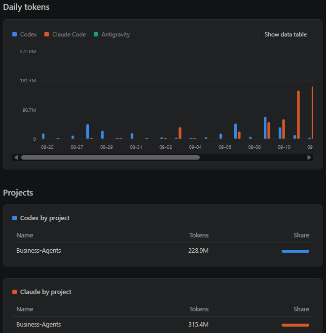
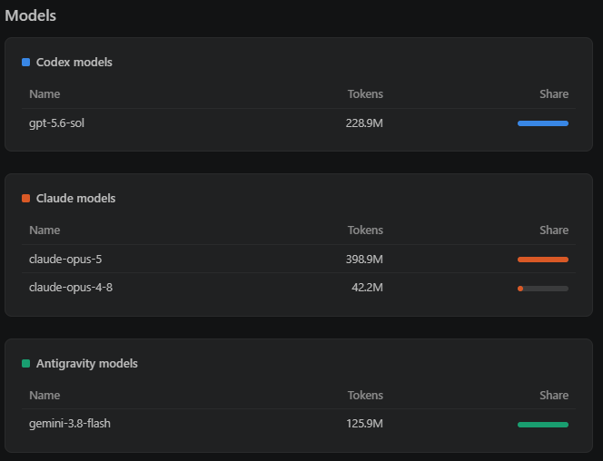

# Agent Usage Monitor

A VS Code editor tab showing how much of your AI coding-agent allowance is left, for
**Codex**, **Claude Code** and **Antigravity (Gemini)** side by side.

Everything is read from files those tools already keep on your machine, plus the same usage
endpoints their own clients call, with the credentials they already stored. There is no server,
no account, and no telemetry — nothing leaves your machine except the usage requests to each
vendor.



## What it shows

### Limits at a glance

One card per tool, showing how much of the current window is left and when it resets. The bar
turns yellow past 40% used and red past 80%, and the countdown is the thing you actually read —
"in 57m" matters more than the timestamp. Codex adds its credit balance and available full resets;
Claude adds extra-usage spend for the month; Antigravity reports a rolling quota shared by all its
Gemini models, and publishes no weekly figure.

| Tool | Limits shown | Source |
|---|---|---|
| Codex | 5-hour + weekly, credit balance, plan | `chatgpt.com/backend-api/wham/usage`, falling back to the last session log |
| Claude Code | 5-hour + weekly, extra-usage spend, plan | `api.anthropic.com/api/oauth/usage` |
| Antigravity | rolling quota per model pool (no weekly figure is published) | `cloudcode-pa.googleapis.com/v1internal:fetchAvailableModels` |

### Token usage

Totals per tool for the last 24 hours, 7 days or 30 days, then a full breakdown: fresh input,
cache reads and writes, output, and how much of that output was reasoning. Cache reads usually
dwarf everything else, which is worth seeing.



### Daily chart and projects

The three tools side by side per day, with a data-table view for exact numbers, and which of your
projects the tokens went to.



### Models

Which models did the work, per tool.



## Install

From the [VS Code Marketplace](https://marketplace.visualstudio.com/items?itemName=jiajilah.agent-usage-monitor),
or search **Agent Usage Monitor** in the Extensions view.

Or build it from source:

```bash
git clone https://github.com/jiajilah/agent-usage-monitor.git
cd agent-usage-monitor
python3 build-vsix.py
code --install-extension jiajilah.agent-usage-monitor-0.1.0.vsix
```

Reload the window, then run **Agent Usage: Open Usage Monitor** from the Command Palette
(<kbd>Ctrl/Cmd</kbd>+<kbd>Shift</kbd>+<kbd>P</kbd>).

Over Remote-SSH, install it on the remote side — that is where the agents' data lives.

## Requirements

- VS Code 1.96 or newer
- `python3` on the machine the extension runs on (it decodes Antigravity's SQLite + protobuf data)
- Whichever agents you use, logged in. Each tool is optional; missing ones are reported, not fatal.

## Settings

| Setting | Default | Meaning |
|---|---|---|
| `agentUsage.lookbackDays` | `90` | How far back to scan session logs |
| `agentUsage.codexHome` | `~/.codex` | Override the Codex home directory |
| `agentUsage.claudeHome` | `~/.claude` | Override the Claude Code home directory |
| `agentUsage.geminiHome` | `~/.gemini/antigravity` | Override the Antigravity data directory |
| `agentUsage.antigravityModel` | `gemini` | Model-name prefix whose Antigravity quota is shown. All `gemini-*` models share one allowance, so the default covers every Gemini version |

## Where the numbers come from

- **Codex** — token counts from `~/.codex/sessions/**/*.jsonl`; live limits using
  `~/.codex/auth.json`. Session logs also record `rate_limits`, so the card falls back to the last
  logged values if the live call fails.
- **Claude Code** — token counts from `~/.claude/projects/**/*.jsonl`; live limits using
  `~/.claude/.credentials.json`. Claude never writes limit percentages to disk, so there is no
  fallback; its money fields are in cents.
- **Antigravity** — token counts decoded by `antigravity_usage.py` from the per-conversation
  SQLite databases in `~/.gemini/antigravity/conversations/*.db`. Each step carries a protobuf blob
  whose usage block was identified by cross-checking two tables that record the same calls; output
  tokens equal thinking + response on every call observed. Conversations saved in the older `*.pb`
  format are encrypted and cannot be counted. Live quota uses
  `~/.gemini/jetski-standalone-oauth-token`.

Parsed log files are cached by size and modification time in the extension's global storage, so
only the first scan is slow. While the tab is open it refreshes every 5 minutes.

## Caveats worth knowing

- **These are undocumented, internal endpoints.** They are the ones each vendor's own client calls,
  but they can change without notice and break this extension. The Antigravity request must send a
  `User-Agent` identifying the Antigravity client or the API returns `403`.
- **Antigravity's field names are inferred.** Its data is raw protobuf with no field names; the
  labels here come from cross-checking, not documentation.
- **Antigravity publishes no weekly limit.** That does not prove no weekly cap exists — only that
  none is reported.
- **Antigravity omits a zero quota.** When its allowance runs out, `remainingFraction` disappears
  from the response rather than reading `0`; a missing value is treated as exhausted.

## License

MIT — see [LICENSE](LICENSE).
